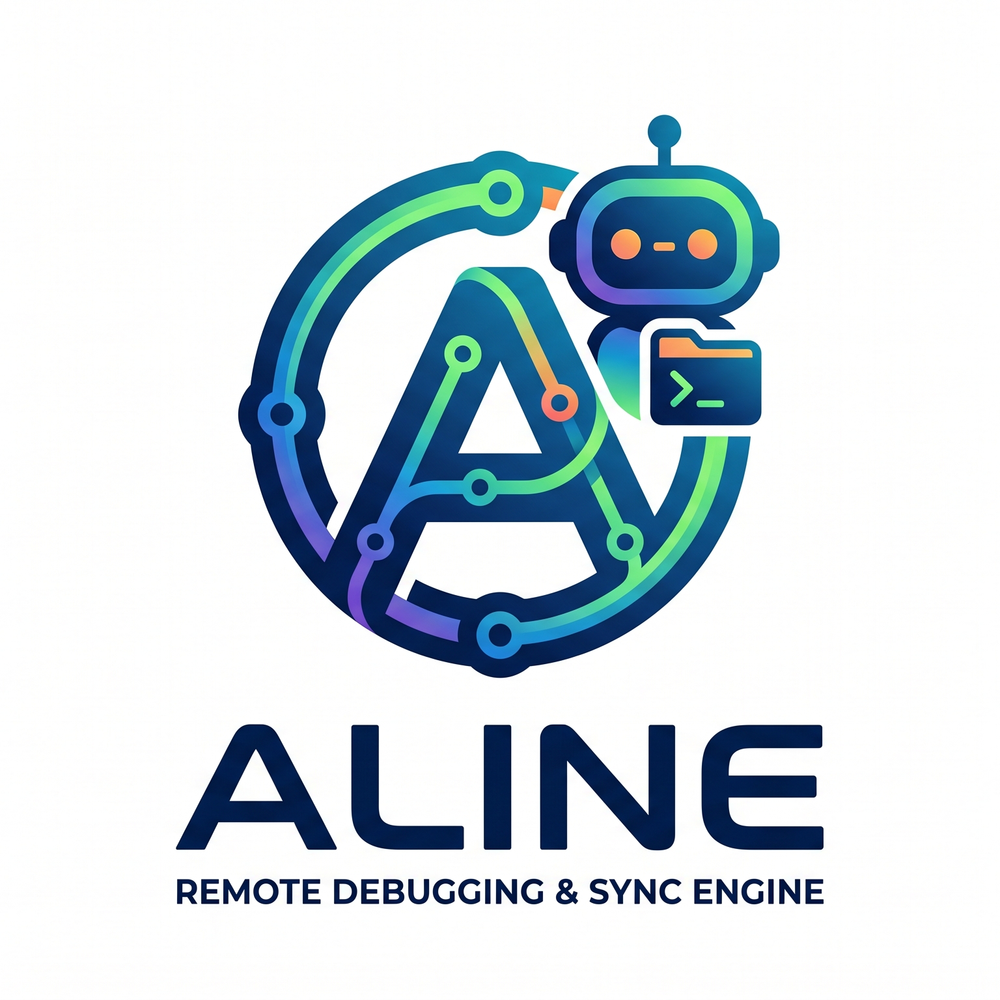

# Aline

<p align="center">
  
</p>

## Table of contents

- [中文概述](#中文概述)
- [Support boundary](#support-boundary)
- [Why Aline exists](#why-aline-exists)
- [Install Aline](#install-aline)
- [Skill installation command](#skill-installation-command)
- [Requirements](#requirements)
- [Quick start](#quick-start)
- [Command overview](#command-overview)
- [Skills shipped with the project](#skills-shipped-with-the-project)
- [Sync backend behavior](#sync-backend-behavior)
- [Current caveats and notes](#current-caveats-and-notes)
- [Development and safety notes](#development-and-safety-notes)

Aline is a CLI + local daemon built for agents that need a reliable way to connect to remote machines, run commands in reusable channels, inspect logs, push and pull files, and keep a local directory synced to a remote Unix-like workspace.

Instead of rebuilding remote SSH workflows ad hoc for every task, Aline provides a consistent interface for:

- connection management
- channel-based command execution
- immediate follow output for fast tasks
- buffered log inspection for long tasks
- explicit push / pull transfers
- background sync for local-to-remote workflows

## 中文概述

Aline 是一个面向agent的远程执行与同步工具。它会启动一个本地守护进程，通过 SSH 连接到远程类 Unix 主机，并为agent提供一个稳定且可脚本化的远程开发工作流。

它的设计旨在减少临时 SSH 工作流中常见的问题：

* agent无需每次都重新构建 `ssh`、`scp` 或 `rsync` 命令行，并且保存命令行状态（如目录，环境）
* 远程命令可以在命名的通道（channels）中运行并保留其运行日志和输出
* 短期任务可以使用 `exec --follow` 即时获取输出
* 长期任务可以使用 `log --tail` 进行检查
* 可以进行文件传输，使用明确的 `--local` 和 `--remote` 标志，从而避免混淆本地和远程路径，通过文件传输可以实现本地编辑，推送到远程运行。

当前支持边界：

* 本地环境：Windows、Linux、macOS
* 远程环境：目前仅支持类 Unix 系统

安装后你可以运行：

```bash
aline --help
```

典型工作流：

```bash
aline connect <host> --json
aline channel add <host> demo --json
aline push <host> --local ./demo/aline-test --remote ~/aline-test --json
aline exec <host> --channel demo --follow "bash -lc 'cd ~/aline-test && python fast_task.py'"
aline pull <host> --remote ~/aline-test --local ./demo/aline-test --json
```

如果你想让 Claude 或其他智能体更稳定地使用 Aline，请安装随附的 `skills/aline/` 技能（skill）。

## Support boundary

Aline currently targets:

- **Local machine:** Windows, Linux, macOS
- **Remote machine:** **Unix-like systems only** for now

Remote Windows is not a supported claim at this stage.

## Why Aline exists

Aline is meant for agent-heavy workflows where a model or automation loop needs a predictable remote control surface instead of repeatedly improvising raw SSH commands, SCP usage, and local shell glue.

It is especially useful when you want agents to:

- connect once and reuse remote state
- run long-lived commands in named channels
- stream short command output with `--follow`
- inspect later output with `log --tail`
- move code or artifacts between local and remote machines explicitly
- standardize validation and troubleshooting workflows through shipped skills

## Install Aline

### Option 1: install from npm

After Aline is published, install globally:

```bash
npm install -g @xyanmi/aline
```

Then verify:

```bash
aline --help
```

A global npm install gives you the `aline` command directly. No separate shell alias is required.

### Option 2: install from a source checkout

From a local checkout, install the current package globally:

```bash
npm install -g .
aline --help
```

For development without a global install, you can also run the entrypoint directly:

```bash
npm install
node ./bin/aline --help
```

### Option 3: use `npx`

After publishing, users can also run Aline without a global install:

```bash
npx --package @xyanmi/aline aline --help
```

## Skill installation command

Aline can install the shipped skill into an agent-specific local skills directory for you.

Examples:

```bash
aline skill claude
aline skill codex
```

That installs the shipped `skills/aline` directory to:

- `aline skill claude` -> `~/.claude/skills/aline`
- `aline skill codex` -> `~/.codex/skills/aline`

If the target directory already exists, rerun with `--force` to replace it:

```bash
aline skill claude --force
```

You can also use `--json` for machine-readable output.

## Requirements

- Node.js 18+
- an SSH config entry for the target host
- local `ssh` and `tar` executables for the portable fallback transfer backend
- optional local `rsync`; if unavailable, Aline falls back to `tar+ssh`
- on Windows, Git Bash / MSYS is supported for normalizing common rewritten remote paths

## Quick start

### 1. Configure an SSH alias

Aline assumes the remote host is reachable through a standard SSH alias in `~/.ssh/config`.

### 2. Connect first

Host-bound actions require an explicit prior `connect`:

```bash
aline connect <host>
```

### 3. Run a command in a named channel

```bash
aline exec <host> --channel setup --follow "pwd"
```

### 4. Inspect logs later

```bash
aline log <host> setup --tail 200
```

## Command overview

All commands support `--json` for machine-readable output.

### Skill installation

```bash
aline skill <agent-name>
```

Examples:

```bash
aline skill claude
aline skill codex
```

- installs the shipped `skills/aline` skill into `~/.<agent-name>/skills/aline`
- use `--force` to replace an existing installed copy
- use `--json` for structured output

### Connection management

```bash
aline connect <host>
aline disconnect <host>
aline connection list
aline status <host>
```

- `connect` establishes the SSH connection in the daemon
- `disconnect` closes the host connection, stops sync watchers for that host, and removes that host's channels
- `exec`, `status`, `push`, `pull`, and `sync start` require an explicit prior `connect`

### Channel management

```bash
aline channel add <host> <name>
aline channel delete <host> <name>
aline channel list <host>
```

- channels are scoped to a host
- `channel delete` is the canonical delete command; `rm` is no longer used
- `channel list` shows the daemon's current channels for the host
- when a task is finished and you no longer need that environment, delete the channel to release resources

### Command execution

```bash
aline exec <host> --channel <name> <command...>
aline exec <host> --channel <name> --follow <command...>
aline log <host> <channel>
aline log <host> <channel> --tail 200
```

Options for `exec`:

- `--channel <name>`: required named channel
- `--follow`: stream output immediately until completion
- `--timeout <ms>`: stop the command if it runs too long
- `--tail <count>`: polling window while following
- `--quiet-exit`: suppress the final `[exit N]` line in follow mode

Behavior notes:

- commands executed in the same channel reuse the same interactive shell session
- shell state persists inside a channel, including `cd` and activated conda environments
- the command should normally be quoted so the local shell does not rewrite it before Aline sends it to the remote host
- `--json` mainly reports Aline-side execution metadata; it is not the same as the remote command's business output
- if you combine `--follow` and `--json`, the output is a mix of JSON and plain text; do not treat the full stream as pure JSON
- `log` returns buffered channel history, including past executions
- although `exec` can create a missing channel implicitly, explicitly creating the channel first is the recommended workflow

### File transfer and sync

Transfer commands require explicit `--local` and `--remote` paths. Positional path arguments are intentionally not supported.

```bash
aline push <host> --local <localPath> --remote <remotePath>
aline pull <host> --remote <remotePath> --local <localPath>
aline sync start <host> --local <localPath> --remote <remotePath>
aline sync stop <host>
```

Shared transfer options:

```bash
-l, --local <path>
-r, --remote <path>
--safe
```

Semantics:

- `push`: local source -> remote destination
- `pull`: remote source -> local destination
- `sync start`: watches local source and pushes to remote destination
- default mode is **mirror**
- `--safe` keeps destination-only files instead of mirroring exactly
- local paths are resolved by the CLI before daemon handoff, so relative local paths are interpreted relative to the shell where you ran `aline`

## A short end-to-end example

```bash
aline connect my-host
aline channel add my-host demo --json
aline push my-host --local ./demo/aline-test --remote ~/aline-test --json
aline exec my-host --channel demo --follow "bash -lc 'cd ~/aline-test && python fast_task.py'"
aline pull my-host --remote ~/aline-test --local ./demo/aline-test --json
```

## Skills shipped with the project

Aline is designed for agents, so the repo ships a formal usage skill under `./skills/`.

### Included shipped skill

- `skills/aline/` — the main Aline workflow and troubleshooting skill

### How to install the shipped skill

The recommended path is to use the built-in installer command:

```bash
aline skill claude
```

You can also target other agent homes, for example:

```bash
aline skill codex
```

This installs the shipped skill into `~/.<agent-name>/skills/aline`.

If you prefer to do it manually, you can still copy or symlink the directory yourself.

Example (copy):

```bash
cp -r skills/aline ~/.claude/skills/
```

Example (symlink on Unix-like systems):

```bash
ln -s /path/to/Aline/skills/aline ~/.claude/skills/aline
```

## Sync backend behavior

Aline can use two transfer backends for `push`, `pull`, and `sync`:

- `rsync`
- `tar+ssh`

If local `rsync` is missing, Aline falls back to `tar+ssh`.

That affects:

- speed
- incremental efficiency
- large-directory experience

It does **not** prevent `push`, `pull`, or `sync` from working. In other words, `rsync` is a performance enhancement, not a hard prerequisite.

The transfer result includes:

- `method: "rsync"`
- `method: "tar+ssh"`

If fallback prerequisites are missing, Aline reports the missing local executable names explicitly.

## Current caveats and notes

### Disconnect semantics

- `disconnect` clears the host's channels from the daemon
- if you want to use that host again after disconnecting, reconnect first

### Remote path handling on Windows

- on Windows Git Bash / MSYS, remote-looking POSIX paths may be rewritten before Node receives them
- Aline normalizes common rewritten forms such as Git Bash `/home/...` and `/tmp/...` conversions back to remote POSIX paths
- transfer commands require `-r/--remote` and `-l/--local` so local and remote paths are never inferred from ambiguous positional ordering

### Help output

- the CLI help includes the Aline ASCII logo on help screens
- normal command output stays plain so scripts and follow-mode output remain readable

## Development and safety notes

For local development:

```bash
npm install
npm test
```

Before sharing changes, also check that public-facing docs and shipped skills do not contain personal host aliases, usernames, IPs, or local absolute paths.

Aline can execute commands and transfer files on remote hosts, so treat access to the local daemon as sensitive:

- keep SSH keys and agents secure
- connect only to trusted hosts
- review commands before running them through Aline
- avoid exposing the local daemon endpoint outside the local machine

When changing docs or tests, keep the support boundary honest: local Windows/Linux/macOS, remote Unix-like only until remote Windows support is explicitly implemented and validated.
